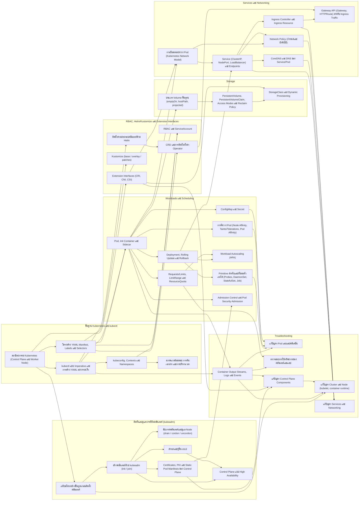

# CKA — Certified Kubernetes Administrator — knowledge graph

Generated from `content/cka/graph.yaml` by `scripts/graph_check.py`. Do not edit by hand.

```mermaid
flowchart LR
  subgraph foundations["พื้นฐาน Kubernetes และ kubectl"]
    k8s-architecture["สถาปัตยกรรม Kubernetes (Control Plane และ Worker Node)"]
    kubectl-imperative["kubectl แบบ Imperative และการสร้าง YAML อย่างรวดเร็ว"]
    yaml-manifests["โครงสร้าง YAML Manifest, Labels และ Selectors"]
    kubeconfig-contexts["kubeconfig, Contexts และ Namespaces"]
    exam-environment-strategy["สภาพแวดล้อมสอบ การค้นเอกสาร และการบริหารเวลา"]
  end
  subgraph cluster-lifecycle["ติดตั้งและดูแลวงจรชีวิตคลัสเตอร์ (kubeadm)"]
    infra-prep["เตรียมโครงสร้างพื้นฐานก่อนติดตั้งคลัสเตอร์"]
    kubeadm-install["สร้างคลัสเตอร์ด้วย kubeadm (init / join)"]
    cluster-upgrade["อัปเกรดคลัสเตอร์และดูแล Node (drain / cordon / uncordon)"]
    etcd-backup-restore["สำรองและกู้คืน etcd"]
    ha-control-plane["Control Plane แบบ High Availability"]
    certificates-pki["Certificates, PKI และ Static Pod Manifests ของ Control Plane"]
  end
  subgraph access-and-extensions["RBAC, Helm/Kustomize และ Extension Interfaces"]
    rbac["RBAC และ ServiceAccount"]
    helm["ติดตั้งส่วนประกอบคลัสเตอร์ด้วย Helm"]
    kustomize["Kustomize (base / overlay / patches)"]
    extension-interfaces["Extension Interfaces (CRI, CNI, CSI)"]
    crds-operators["CRD และการติดตั้ง/ตั้งค่า Operator"]
  end
  subgraph workloads-scheduling["Workloads และ Scheduling"]
    pods-multicontainer["Pod, Init Container และ Sidecar"]
    deployments-rollouts["Deployment, Rolling Update และ Rollback"]
    configmaps-secrets["ConfigMap และ Secret"]
    self-healing-primitives["Primitive สำหรับแอปที่ซ่อมตัวเองได้ (Probes, DaemonSet, StatefulSet, Job)"]
    resources-limits["Requests/Limits, LimitRange และ ResourceQuota"]
    workload-autoscaling["Workload Autoscaling (HPA)"]
    scheduling-placement["การจัดวาง Pod (Node Affinity, Taints/Tolerations, Pod Affinity)"]
    admission-control["Admission Control และ Pod Security Admission"]
  end
  subgraph services-networking["Services และ Networking"]
    pod-connectivity["การเชื่อมต่อระหว่าง Pod (Kubernetes Network Model)"]
    services["Service (ClusterIP, NodePort, LoadBalancer) และ Endpoints"]
    coredns["CoreDNS และ DNS ของ Service/Pod"]
    network-policies["Network Policy (กำหนดและบังคับใช้)"]
    ingress["Ingress Controller และ Ingress Resource"]
    gateway-api["Gateway API (Gateway, HTTPRoute) สำหรับ Ingress Traffic"]
  end
  subgraph storage["Storage"]
    volumes-basics["ประเภท Volume พื้นฐาน (emptyDir, hostPath, projected)"]
    pv-pvc["PersistentVolume, PersistentVolumeClaim, Access Modes และ Reclaim Policy"]
    storageclass-dynamic["StorageClass และ Dynamic Provisioning"]
  end
  subgraph troubleshooting["Troubleshooting"]
    logs-and-events["Container Output Streams, Logs และ Events"]
    troubleshoot-applications["แก้ปัญหา Pod และแอปพลิเคชัน"]
    resource-monitoring["ตรวจสอบการใช้ทรัพยากรของคลัสเตอร์และแอป"]
    troubleshoot-control-plane["แก้ปัญหา Control Plane Components"]
    troubleshoot-nodes["แก้ปัญหา Cluster และ Node (kubelet, container runtime)"]
    troubleshoot-networking["แก้ปัญหา Services และ Networking"]
  end
  k8s-architecture --> kubectl-imperative
  k8s-architecture --> yaml-manifests
  kubectl-imperative --> kubeconfig-contexts
  kubeconfig-contexts --> exam-environment-strategy
  k8s-architecture --> infra-prep
  infra-prep --> kubeadm-install
  kubeadm-install --> cluster-upgrade
  kubeadm-install --> etcd-backup-restore
  kubeadm-install --> ha-control-plane
  etcd-backup-restore --> ha-control-plane
  kubeadm-install --> certificates-pki
  kubeconfig-contexts --> rbac
  yaml-manifests --> rbac
  kubectl-imperative --> helm
  yaml-manifests --> kustomize
  k8s-architecture --> extension-interfaces
  yaml-manifests --> crds-operators
  helm --> crds-operators
  yaml-manifests --> pods-multicontainer
  kubectl-imperative --> pods-multicontainer
  pods-multicontainer --> deployments-rollouts
  pods-multicontainer --> configmaps-secrets
  deployments-rollouts --> self-healing-primitives
  pods-multicontainer --> resources-limits
  deployments-rollouts --> workload-autoscaling
  resources-limits --> workload-autoscaling
  pods-multicontainer --> scheduling-placement
  certificates-pki --> admission-control
  pods-multicontainer --> admission-control
  pods-multicontainer --> pod-connectivity
  extension-interfaces --> pod-connectivity
  pod-connectivity --> services
  deployments-rollouts --> services
  services --> coredns
  pod-connectivity --> network-policies
  services --> network-policies
  services --> ingress
  ingress --> gateway-api
  crds-operators --> gateway-api
  pods-multicontainer --> volumes-basics
  volumes-basics --> pv-pvc
  pv-pvc --> storageclass-dynamic
  extension-interfaces --> storageclass-dynamic
  kubectl-imperative --> logs-and-events
  pods-multicontainer --> logs-and-events
  logs-and-events --> troubleshoot-applications
  self-healing-primitives --> troubleshoot-applications
  scheduling-placement --> troubleshoot-applications
  configmaps-secrets --> troubleshoot-applications
  logs-and-events --> resource-monitoring
  resources-limits --> resource-monitoring
  certificates-pki --> troubleshoot-control-plane
  extension-interfaces --> troubleshoot-control-plane
  logs-and-events --> troubleshoot-control-plane
  infra-prep --> troubleshoot-nodes
  logs-and-events --> troubleshoot-nodes
  troubleshoot-control-plane --> troubleshoot-nodes
  services --> troubleshoot-networking
  coredns --> troubleshoot-networking
  network-policies --> troubleshoot-networking
  ingress --> troubleshoot-networking
```
