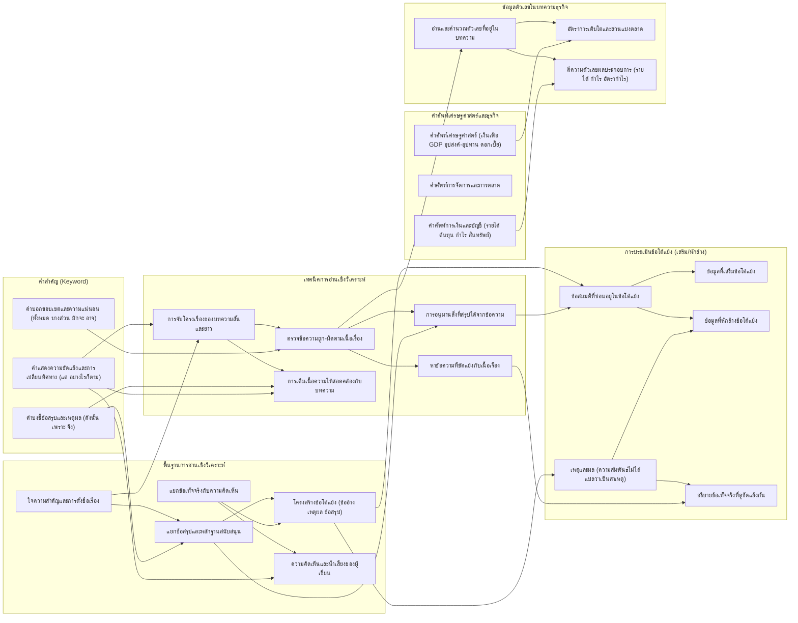

# CU-BEST วิเคราะห์ธุรกิจ — knowledge graph

Generated from `content/cu-best-business/graph.yaml` by `scripts/graph_check.py`. Do not edit by hand.

```mermaid
flowchart LR
  subgraph analytical-reading-basics["พื้นฐานการอ่านเชิงวิเคราะห์"]
    main-idea["ใจความสำคัญและการตั้งชื่อเรื่อง"]
    fact-vs-opinion["แยกข้อเท็จจริงกับความคิดเห็น"]
    conclusion-evidence["แยกข้อสรุปและหลักฐานสนับสนุน"]
    argument-structure["โครงสร้างข้อโต้แย้ง (ข้ออ้าง เหตุผล ข้อสรุป)"]
    author-viewpoint["ความคิดเห็นและน้ำเสียงของผู้เขียน"]
  end
  subgraph keywords["คำสำคัญ (Keyword)"]
    conclusion-signals["คำบ่งชี้ข้อสรุปและเหตุผล (ดังนั้น เพราะ จึง)"]
    contrast-signals["คำแสดงความขัดแย้งและการเปลี่ยนทิศทาง (แต่ อย่างไรก็ตาม)"]
    qualifier-words["คำบอกขอบเขตและความแน่นอน (ทั้งหมด บางส่วน มักจะ อาจ)"]
  end
  subgraph reading-techniques["เทคนิคการอ่านเชิงวิเคราะห์"]
    passage-mapping["การจับโครงเรื่องของบทความสั้นและยาว"]
    detail-check["ตรวจข้อความถูก-ผิดตามเนื้อเรื่อง"]
    inference["การอนุมานสิ่งที่สรุปได้จากข้อความ"]
    text-completion["การเติมเนื้อความให้สอดคล้องกับบทความ"]
    contradiction-with-passage["หาข้อความที่ขัดแย้งกับเนื้อเรื่อง"]
  end
  subgraph argument-evaluation["การประเมินข้อโต้แย้ง (เสริม/หักล้าง)"]
    assumption["ข้อสมมติที่ซ่อนอยู่ในข้อโต้แย้ง"]
    causal-reasoning["เหตุและผล (ความสัมพันธ์ไม่ได้แปลว่าเป็นสาเหตุ)"]
    strengthen["ข้อมูลที่เสริมข้อโต้แย้ง"]
    weaken["ข้อมูลที่หักล้างข้อโต้แย้ง"]
    paradox-resolution["อธิบายข้อเท็จจริงที่ดูขัดแย้งกัน"]
  end
  subgraph business-vocabulary["คำศัพท์เศรษฐศาสตร์และธุรกิจ"]
    economics-terms["คำศัพท์เศรษฐศาสตร์ (เงินเฟ้อ GDP อุปสงค์-อุปทาน ดอกเบี้ย)"]
    management-marketing-terms["คำศัพท์การจัดการและการตลาด"]
    finance-accounting-terms["คำศัพท์การเงินและบัญชี (รายได้ ต้นทุน กำไร สินทรัพย์)"]
  end
  subgraph data-in-passage["ข้อมูลตัวเลขในบทความธุรกิจ"]
    numbers-in-passage["อ่านและคำนวณตัวเลขที่อยู่ในบทความ"]
    growth-and-share["อัตราการเติบโตและส่วนแบ่งตลาด"]
    financial-figures["ตีความตัวเลขผลประกอบการ (รายได้ กำไร อัตรากำไร)"]
  end
  main-idea --> conclusion-evidence
  conclusion-signals --> conclusion-evidence
  conclusion-evidence --> argument-structure
  fact-vs-opinion --> argument-structure
  fact-vs-opinion --> author-viewpoint
  contrast-signals --> author-viewpoint
  main-idea --> passage-mapping
  contrast-signals --> passage-mapping
  passage-mapping --> detail-check
  qualifier-words --> detail-check
  detail-check --> inference
  conclusion-evidence --> inference
  passage-mapping --> text-completion
  conclusion-signals --> text-completion
  contrast-signals --> text-completion
  detail-check --> contradiction-with-passage
  argument-structure --> assumption
  inference --> assumption
  argument-structure --> causal-reasoning
  assumption --> strengthen
  assumption --> weaken
  causal-reasoning --> weaken
  causal-reasoning --> paradox-resolution
  contradiction-with-passage --> paradox-resolution
  detail-check --> numbers-in-passage
  numbers-in-passage --> growth-and-share
  economics-terms --> growth-and-share
  numbers-in-passage --> financial-figures
  finance-accounting-terms --> financial-figures
```
