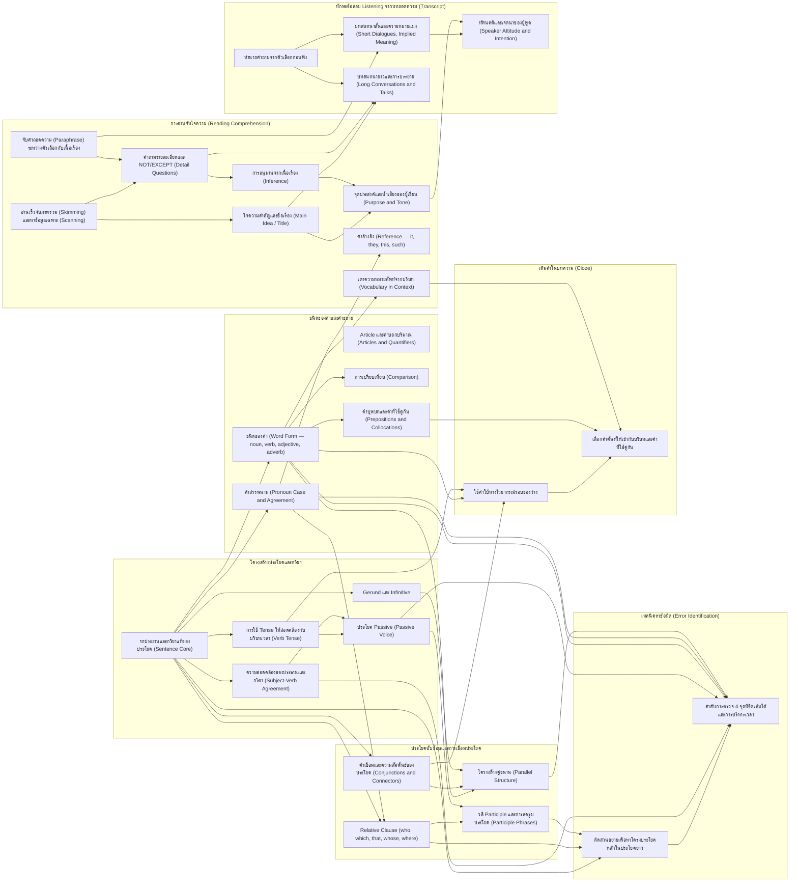

# CU-TEP ภาษาอังกฤษ — knowledge graph

Generated from `content/cu-tep/graph.yaml` by `scripts/graph_check.py`. Do not edit by hand.

```mermaid
flowchart LR
  subgraph sentence-and-verbs["โครงสร้างประโยคและกริยา"]
    sentence-core["หาประธานและกริยาแท้ของประโยค (Sentence Core)"]
    subject-verb-agreement["ความสอดคล้องของประธานและกริยา (Subject-Verb Agreement)"]
    verb-tense["การใช้ Tense ให้สอดคล้องกับบริบทเวลา (Verb Tense)"]
    passive-voice["ประโยค Passive (Passive Voice)"]
    gerund-infinitive["Gerund และ Infinitive"]
  end
  subgraph words-and-modifiers["ชนิดของคำและคำขยาย"]
    word-form["ชนิดของคำ (Word Form — noun, verb, adjective, adverb)"]
    pronouns["คำสรรพนาม (Pronoun Case and Agreement)"]
    articles-quantifiers["Article และคำบอกปริมาณ (Articles and Quantifiers)"]
    comparison["การเปรียบเทียบ (Comparison)"]
    prepositions["คำบุพบทและคำที่ใช้คู่กัน (Prepositions and Collocations)"]
  end
  subgraph complex-sentences["ประโยคซับซ้อนและการเชื่อมประโยค"]
    conjunctions-connectors["คำเชื่อมและความสัมพันธ์ของประโยค (Conjunctions and Connectors)"]
    relative-clauses["Relative Clause (who, which, that, whose, where)"]
    participle-phrases["วลี Participle และการลดรูปประโยค (Participle Phrases)"]
    parallel-structure["โครงสร้างคู่ขนาน (Parallel Structure)"]
  end
  subgraph error-id-technique["เทคนิคหาข้อผิด (Error Identification)"]
    long-sentence-stripping["ตัดส่วนขยายเพื่อหาโครงประโยคหลักในประโยคยาว"]
    error-id-checklist["ลำดับการตรวจ 4 จุดที่ขีดเส้นใต้และการบริหารเวลา"]
  end
  subgraph cloze-passage["เติมคำในบทความ (Cloze)"]
    cloze-grammar-clues["ใช้คำใบ้ทางไวยากรณ์รอบช่องว่าง"]
    cloze-word-choice["เลือกคำศัพท์ให้เข้ากับบริบทและคำที่ใช้คู่กัน"]
  end
  subgraph reading-comprehension["การอ่านจับใจความ (Reading Comprehension)"]
    skim-and-scan["อ่านเร็วจับภาพรวม (Skimming) และหาข้อมูลเฉพาะ (Scanning)"]
    paraphrase-recognition["จับคำถอดความ (Paraphrase) ระหว่างตัวเลือกกับเนื้อเรื่อง"]
    main-idea["ใจความสำคัญและชื่อเรื่อง (Main Idea / Title)"]
    detail-questions["คำถามรายละเอียดและ NOT/EXCEPT (Detail Questions)"]
    vocab-in-context["เดาความหมายศัพท์จากบริบท (Vocabulary in Context)"]
    reference-words["คำอ้างอิง (Reference — it, they, this, such)"]
    inference["การอนุมานจากเนื้อเรื่อง (Inference)"]
    author-purpose-tone["จุดประสงค์และน้ำเสียงของผู้เขียน (Purpose and Tone)"]
  end
  subgraph listening-transcripts["ทักษะข้อสอบ Listening จากบทถอดความ (Transcript)"]
    predict-from-choices["ทำนายคำถามจากตัวเลือกก่อนฟัง"]
    short-dialogue["บทสนทนาสั้นและความหมายแฝง (Short Dialogues, Implied Meaning)"]
    speaker-attitude["ทัศนคติและเจตนาของผู้พูด (Speaker Attitude and Intention)"]
    long-conversation-talk["บทสนทนายาวและการบรรยาย (Long Conversations and Talks)"]
  end
  sentence-core --> subject-verb-agreement
  sentence-core --> verb-tense
  verb-tense --> passive-voice
  subject-verb-agreement --> passive-voice
  sentence-core --> gerund-infinitive
  sentence-core --> word-form
  sentence-core --> pronouns
  word-form --> comparison
  word-form --> prepositions
  sentence-core --> conjunctions-connectors
  sentence-core --> relative-clauses
  pronouns --> relative-clauses
  relative-clauses --> participle-phrases
  passive-voice --> participle-phrases
  word-form --> parallel-structure
  conjunctions-connectors --> parallel-structure
  gerund-infinitive --> parallel-structure
  sentence-core --> long-sentence-stripping
  relative-clauses --> long-sentence-stripping
  participle-phrases --> long-sentence-stripping
  long-sentence-stripping --> error-id-checklist
  subject-verb-agreement --> error-id-checklist
  passive-voice --> error-id-checklist
  word-form --> error-id-checklist
  pronouns --> error-id-checklist
  parallel-structure --> error-id-checklist
  word-form --> cloze-grammar-clues
  verb-tense --> cloze-grammar-clues
  conjunctions-connectors --> cloze-grammar-clues
  cloze-grammar-clues --> cloze-word-choice
  prepositions --> cloze-word-choice
  vocab-in-context --> cloze-word-choice
  skim-and-scan --> main-idea
  skim-and-scan --> detail-questions
  paraphrase-recognition --> detail-questions
  word-form --> vocab-in-context
  pronouns --> reference-words
  detail-questions --> inference
  main-idea --> author-purpose-tone
  inference --> author-purpose-tone
  predict-from-choices --> short-dialogue
  paraphrase-recognition --> short-dialogue
  short-dialogue --> speaker-attitude
  author-purpose-tone --> speaker-attitude
  predict-from-choices --> long-conversation-talk
  main-idea --> long-conversation-talk
  detail-questions --> long-conversation-talk
```
